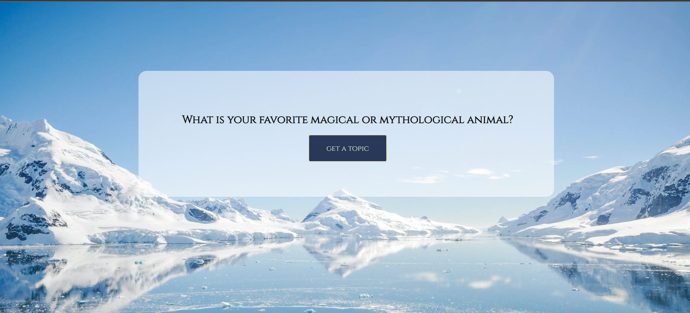

## icebreaker
The project is a simple throw-together app I built on a weekend night while being snowed in. It is a self-contained app that displays a random icebreaker question from a list of just over 100 options and opens the door to fun conversations.

## Motivation
Due to being on work-from-home near permanently due to Covid-19, our team has weekly “water cooler” style breaks where no work topic is allowed to be discussed. The hypothesis is this: forcing organic interpersonal relationships a-la “mandatory fun” style has a negative net effect. By having a tool that generates silly conversation starters, and lets your teammates answer in their own way in their own time generates better outcomes. 

## Build Status
Complete, no future features are planned for this project.
[](https://app.netlify.com/sites/sappyicebreakers/deploys)

## Screenshot


## Tech/framework used
If you came here looking for the latest cutting edge tech in use, you will be sad. Javascript, HTML, CSS. Nothin' fancy.

## Features
It has a button...

## Code Example
```javascript
function getTopic() {
    const keys = Object.keys(questions);
    const output = Math.floor(Math.random()*keys.length);
    document.getElementById("prompt").innerHTML = questions[output];
  }
```

## Installation
Literally copy/paste from the repo if you are that desprate lmao.

## API Reference
Ok so I *could* have written an API for this and called it. Instead I made a giant key-value pair object that I just reference. There is no spoon neo, there is no API.

## Tests
I made console.log() statements until it ran.

## How to use?
Click button, get question, answer question. Do not email me your answers.

## Contibute
Sure, I take irony money. email me your venmo.

## Credits
Me.

## License
Take it if you want it. I literally stole the backround art.
